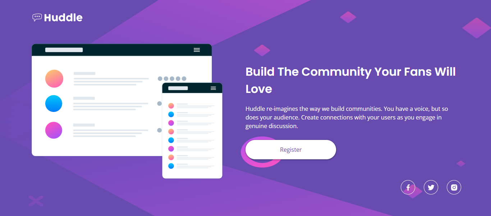

# ✨ Frontend Mentor - Huddle landing page



Mi solución al desafío "Huddle landing page" de [Frontend Mentor](https://www.frontendmentor.io). Este proyecto se centra en la construcción de una **landing page** responsiva para "Huddle", ofreciendo una experiencia de usuario optimizada en cualquier dispositivo.

## 🎯 Desafío Abordado

Los usuarios deberían poder:

- Visualizar el **layout** óptimo de la **landing page** adaptado a diferentes tamaños de pantalla (escritorio y móvil).
- Experimentar los estados de `hover` para todos los elementos interactivos presentes en la página, proporcionando retroalimentación visual.

## 🚀 Tecnologías Clave Utilizadas

- **HTML5 Semántico**: Para una estructura de contenido clara, accesible y bien organizada.
- **CSS3**:
  - **Propiedades Personalizadas (Variables CSS)**: Para mantener una paleta de colores y tipografía consistente y fácil de mantener.
  - **Flexbox**: Esencial para la creación de layouts flexibles y la alineación de elementos.
  - **Media Queries**: Implementación de un **Mobile-first workflow** para asegurar una adaptación fluida a todos los dispositivos.
  - **Filtros CSS (`filter`)**: Utilizados estratégicamente para manipular el color de los iconos SVG (cuando se incrustan como ``), abordando un desafío común de estilización.

## 💻 Cómo Ver el Proyecto

Para explorar el proyecto localmente, sigue estos pasos:

1.  Clona este repositorio en tu máquina:
    ```sh
    git clone https://github.com/josecervera20/huddle-landing-page.git
    ```
2.  Accede al directorio del proyecto:
    ```sh
    cd huddle-landing-page
    ```
3.  Abre el archivo `index.html` en tu navegador web de preferencia.

## 🧑‍💻 Autor

- **José Luis Cervera** - [GitHub](https://github.com/josecervera20)
